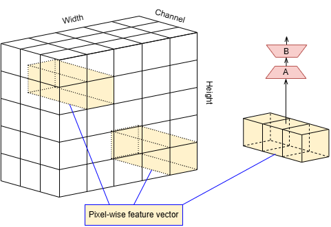

# Source code for “Low-Rank Adaptation in Multilinear Operator Networks for Security-Preserving Incremental Learning”


## Introduction

> **Abstract**: In security-sensitive fields, data should be encrypted to protect against unauthorized access and maintain confidentiality throughout processing. However, traditional networks like ViTs and CNNs return different results when processing original data versus its encrypted form, meaning that they require data to be decrypted, posing a security risk by exposing sensitive information. One solution for this issue is using polynomial networks, including state-of-the-art Multilinear Operator Networks, which return the same outputs given the real data and their encrypted forms under Leveled Fully Homomorphic Encryption. Nevertheless, these models are susceptible to catastrophic forgetting in incremental learning settings. Thus this paper will present a new low-rank adaptation method combined with the Gradient Projection Memory mechanism to minimize the issue. Our proposal is compatible with Leveled Fully Homomorphic Encryption while achieving a sharp improvement in performance compared to existing models.

**TLDR**: Polynomial networks securely process encrypted data but are vulnerable to catastrophic forgetting. Our method introduces a low-rank adaptation with Gradient Projection Memory, improving performance.

<!--  -->
<div align="center">
  
</div>

## Environment setup
First, install Pytorch v2.3.1:
```
pip install torch==2.3.1 torchvision==0.18.1 torchaudio==2.3.1 --index-url https://download.pytorch.org/whl/cu118
```
Then, install other modules using:
```
pip install -r requirements.txt
```

Get MONet pretrained model from [here](https://github.com/Allencheng97/Multilinear_Operator_Networks/tree/main?tab=readme-ov-file#evaluation), which is named `MONet_S.pth`; and store it in `checkpoints/` folder.


## Set up Datasets ##
 * Create a folder `data/`
 * **CIFAR 100**: should automatically be downloaded
 * **ImageNet-R**: download dataset from https://people.eecs.berkeley.edu/~hendrycks/imagenet-r.tar. After unzipping, place it into `data/` folder 
 * **PACS**: download from https://huggingface.co/datasets/flwrlabs/pacs/ or https://www.kaggle.com/datasets/nickfratto/pacs-dataset, place it into `data/` folder 

## Training
We use the following commands to train our proposed model:
```
python3 main.py --device 0 --config CONFIG --model MODEL --finetune TRAINABLE_PARAM --exp EXP_NAME --use_gpm --alpha_gpm ALPHA_GPM
```

Here:

- CONFIG: directory of a config file taken from `configs/` folder: These files are:

  - mimg5_polora.json: ImageNet-R 5 tasks
  - mimg10_polora.json: ImageNet-R 10 tasks
  - mimg20_polora.json: ImageNet-R 20 tasks
  - cifar100_5_polora.json: CIFAR-100 5 tasks
  - cifar100_10_polora.json: CIFAR-100 10 tasks
  - pacs_polora_80norm.json: PACS 4 tasks

- MODEL: MONet_NoDownLora_SkipLora (PoLoRA-M), MONet_Projlora (PoLoRA-C), MONet_S (base model)

- TRAINABLE_PARAM: `full` (train all parameters), `lora_A` (train A parameters), `lora_B` (train B parameters), `none` (no trainable parameters)

  - Note: `none` must stay alone, meanwhile other values can stand with each other as TRAINABLE_PARAM is a list.

- EXP_NAME: Name of the experiment

- `--use_gpm`: Whether to use GPM

- ALPHA_GPM: GPM scaling factor

Example:

### CIFAR100 10 tasks:
#### IPoLoRA-M
```
python3 main.py --device 0 --config configs/cifar100_10_polora.json --model MONet_NoDownLora_SkipLora --finetune lora_B --exp test --use_gpm --alpha_gpm 200
```

### PACS:
#### IPoLoRA-C
```
python3 main.py --device 0 --config configs/pacs_polora_80norm.json --model MONet_Projlora --finetune lora_B --exp test --use_gpm --alpha_gpm 2
```

## Evaluation ##

To evaluate the result, set the flag `--test` and set the model trained after `t-th` task as `--tasktest t`.

Example:

### CIFAR100 10 tasks:
#### IPoLoRA-C after 9-th task.
```
python3 main.py --device 0 --config configs/cifar100_10_polora.json --model MONet_Projlora --finetune lora_B --exp test --use_gpm --alpha_gpm 2 --test --tasktest 9
```

## Acknoledgements
We thank the following repos providing helpful components/functions in our work.

- [Multilinear_Operator_Networks](https://github.com/Allencheng97/Multilinear_Operator_Networks)
- [InfLoRA](InfLoRA)


